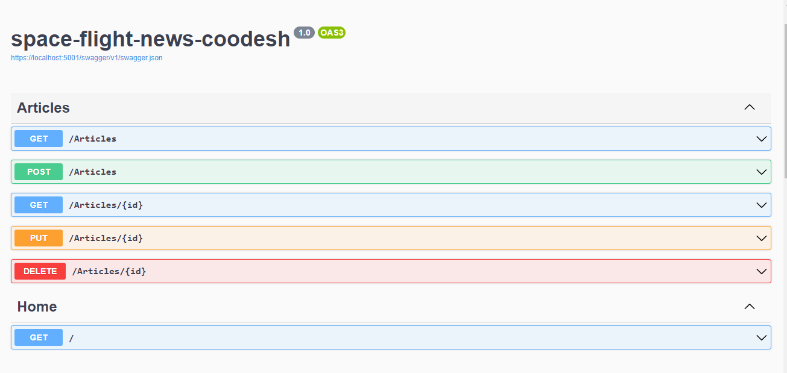

# Space Flight News Coodesh

> This is a challenge by [Coodesh](https://coodesh.com/)

Uma Web API feita em .NET Core que permite operações de CRUD em uma base de dados que armazena artigos sobre o espaço.

## Tecnologias utilizadas

 1. .NET Core
 2. MongoDB
 3. Restsharp
 4. XUnit
 5. Swagger

## Como rodar o projeto?
Clone o repositório para a sua máquina com o comando:

    git clone https://github.com/lucas404x/space-flight-news-coodesh
 Logo em seguida, dentro da pasta do projeto, execute o comando:
 

    dotnet run
E, por fim, acesse a seguinte rota para acessar a tela de boas-vindas da API:
`https://localhost:5001/`

Caso não tenha o dotnet instalado, acesse esse [link](https://dotnet.microsoft.com/en-us/download/dotnet/6.0) e instale a versão 6.0, que que a versão utilizada no projeto.
 
## Documentação da API

Para acessar a documentação, acesse a rota `https://localhost:5001/swagger/index.html`

## Considerações finais
Foi super divertido e prazeroso. Reforcei conhecimentos passados e, claro, consegui aprender coisas novas através do projeto. Muito obrigado a todos por essa oportunidade!